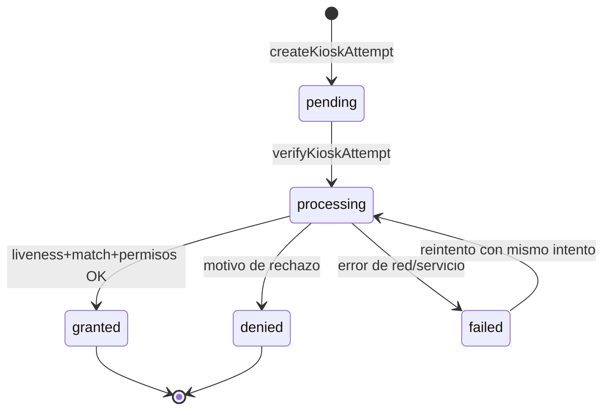
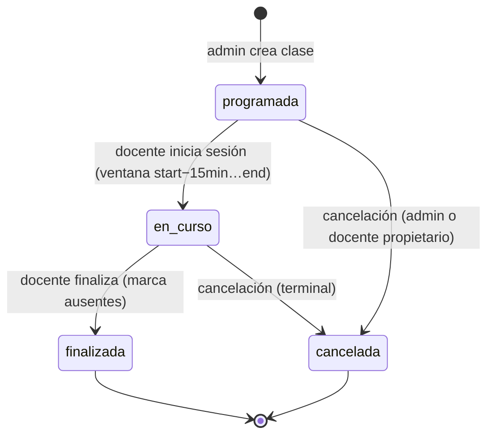
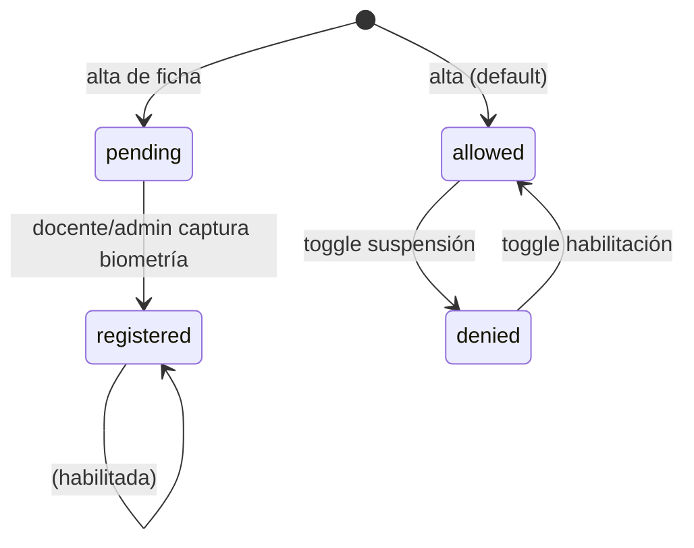
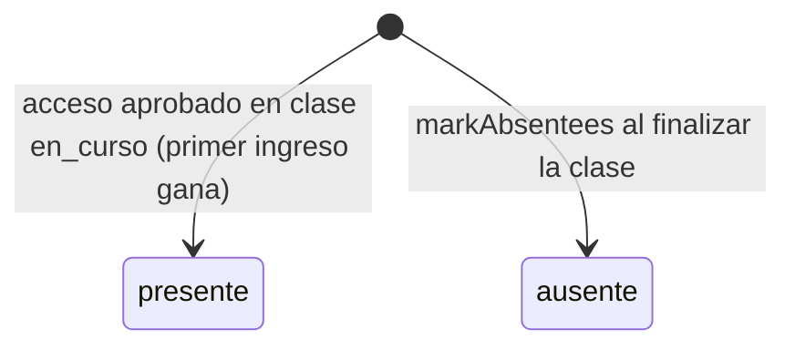
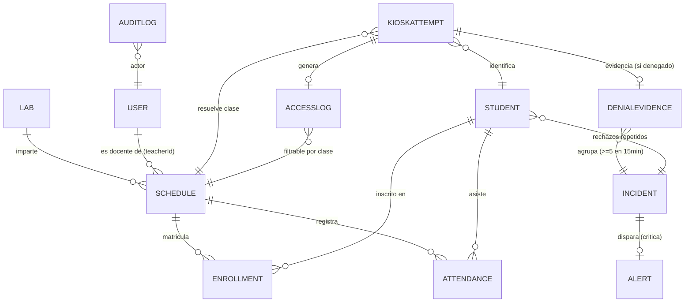

# Modelo Conceptual — Sistema de Aprobación de Acceso

**Proyecto:** FaceAccess Lab — Control de Acceso Biométrico a Laboratorios
**Alcance:** Sistema de aprobación (autorización de acceso al laboratorio)
**Fuentes:** `lib/scheduling.ts`, `lib/kiosk-verification.ts`, `lib/models.ts`, `lib/handlers.ts`, `lib/evidence.ts`, `lib/rbac.ts`, rutas `app/api/kiosk/**`, `app/api/schedules/**`, `app/api/enrollments/**`, `src/lib/kiosk-feedback.ts`, `docs/EVOLUCION-ACADEMICA.md`, `docs/PLAN-ARQUITECTURA.md`, `docs/inventario-pantallas.md`.

---

## 1. Propósito del sistema

El sistema de aprobación decide **si una persona puede entrar a un laboratorio** y **registra la evidencia de esa decisión**. La aprobación no la otorga un humano en el momento: es un **pipeline automático y secuencial** ejecutado por el kiosco que combina:

1. **Vivacidad** (AWS Face Liveness) — probar que hay una persona real frente a la cámara.
2. **Comparación biométrica** (Rekognition) — identificar quién es la persona.
3. **Permisos** (`canAccessLab`) — validar si esa persona *debe* tener acceso **ahora** (clase en curso, laboratorio correcto, inscrita, biometría registrada, cuenta habilitada).

Una decisión **aprobada** produce: log de acceso (`Permitido`) + registro de asistencia (`presente`).
Una decisión **denegada** produce: log de acceso (`Denegado`) + motivo específico + foto de evidencia en S3; si se repite en una ventana corta, abre un incidente, alerta crítica y notificación SNS.

El estado de la decisión debe ser **auditable e idempotente**: un intento verificado no cambia su resultado aunque el kiosco reintente la petición.

---

## 2. Actores primarios

### Actores

| Actor | Goal | Main tasks | Notes |
|---|---|---|---|
| **Estudiante** | Entrar al laboratorio cuando tiene clase | Se encuadra frente al kiosco, pasa liveness, recibe acceso o motivo de rechazo | No inicia sesión; interactúa solo con el kiosco. No ve el panel administrativo. |
| **Docente** | Operar sus clases en el laboratorio | Inicia/finaliza sesión de clase; inscribe estudiantes en sus clases; registra biometría de sus estudiantes; ve sus asistencias/logs/incidentes | Filtrado por `teacherId`: solo ve sus datos. No modifica horarios/labs/materias de sus clases. |
| **Admin** | Configurar y supervisar todo el sistema | Crea labs, clases y usuarios; habilita/suspende estudiantes; cierra incidentes; ve reportes globales y auditoría | Único rol que gestiona infraestructura y cierra incidentes. |
| **Kiosco (dispositivo)** | Ejecutar la verificación de forma autónoma | Crea intentos, ejecuta captura → liveness → compare → authorize, muestra resultado | Actor automatizado; se identifica por `KIOSK_ID`/`KIOSK_LAB`. El "aprobador" real del flujo. |
| **Sistema (automático)** | Generar evidencia y alertas sin intervención | Registra Attendance, DenialEvidence, Incident, Alert, SNS, AuditLog | Backend + AWS. |

---

## 3. Objetos / entidades primarias

### Objetos

| Object | Definition | Key attributes | Related objects |
|---|---|---|---|
| **Student** | Ficha académica + biometría de una persona que puede acceder | `id`, `status` (allowed/denied), `biometricStatus` (pending/registered), `matchPercentage` (umbral de similitud), `photoUrl/photoKey` | Enrollment, Attendance, AccessLog, DenialEvidence, KioskAttempt |
| **User** | Cuenta de acceso al panel (admin/docente/estudiante) | `role`, `status` (active/inactive/suspended), `mfaEnabled`, `studentId` | Schedule (teacherId), AuditLog |
| **Lab** | Laboratorio físico con su kiosco | `code`, `name`, `active` | Schedule, KioskAttempt, AccessLog |
| **Schedule (clase)** | Sesión académica planificada en un lab; **núcleo de la aprobación** | `subject`, `teacherId`, `labCode`, `dayOfWeek`, `startTime/endTime`, `status` (programada/en_curso/finalizada/cancelada), `active`, `deliveryMode`, `requiresPhysicalAccess`, `activeKiosk` | Enrollment, Attendance, AccessLog, KioskAttempt |
| **Enrollment** | Vínculo estudiante ↔ clase (inscripción) | `scheduleId`, `studentId`, `active` | Schedule, Student |
| **KioskAttempt** | Intento efímero de verificación; encadena liveness, match y autorización | `status` (pending/processing/granted/denied/failed), `livenessSessionId`, `attemptTokenHash`, `allowed`, `reason`, `expiresAt` | AccessLog, DenialEvidence, Student, Schedule |
| **AccessLog** | Registro permanente de cada decisión (aprobado/denegado) | `result` (Permitido/Denegado), `reason`, `similarity`, `scheduleId`, `recognitionMs` | KioskAttempt, Student, Schedule |
| **Attendance** | Asistencia a una clase | `status` (presente/ausente), `date`, `scheduleId`, `studentId` | Schedule, Student |
| **DenialEvidence** | Foto (S3) + motivo de un rechazo | `photoKey`, `reason`, `confidence`, `attemptId` | KioskAttempt, Incident, Student |
| **Incident** | Agrupación de rechazos repetidos o anomalía de kiosco | `type` (repeated_denials/kiosk_anomaly), `status` (open/closed), `count`, `evidenceIds` | DenialEvidence, Alert, Student |
| **Alert** | Aviso visible/notificado | `severity`, `status` (active/acknowledged/resolved) | Incident |
| **AuditLog** | Traza de acciones de admin/docente | `actor`, `action`, `targetType`, `before/after`, `ip` | User |

---

## 4. Acciones disponibles sobre cada objeto

### Acciones

| Action | Target object | Preconditions | Result |
|---|---|---|---|
| Crear intento (`POST /api/kiosk/attempt`) | KioskAttempt | Kiosco válido; límite de rate | Intento `pending` con token (cookie) + sesión de liveness |
| Verificar (`POST /api/kiosk/verify`) | KioskAttempt | Token de intento válido y sin expirar; imagen ≤ 2 MiB | Intento → `granted` o `denied`; crea AccessLog (+ Attendance/Evidence/Incident según resultado) |
| Iniciar sesión de clase | Schedule | Rol docente y ser `teacherId` de la clase (o admin) | `status` → `en_curso` |
| Finalizar sesión de clase | Schedule | Idem | `status` → `finalizada`; marca ausentes automáticamente (`markAbsentees`) |
| Cancelar clase | Schedule | Admin o docente propietario (decisión A7) | `status` → `cancelada` (terminal) |
| Crear/editar clase | Schedule | Admin (crear) / admin o docente propietario (editar) | Clase activa; el docente solo puede cambiar `status` |
| Eliminar clase | Schedule | Admin | Elimina clase + sus enrollments |
| Inscribir estudiante | Enrollment | Admin o docente propietario de la clase; estudiante existente; sin duplicado | Enrollment activo |
| Eliminar inscripción | Enrollment | Admin o docente propietario | Enrollment eliminado |
| Registrar estudiante | Student | Admin, o docente con `scheduleId` de su clase (hereda lab) | Student creado (+ Enrollment si venía con clase) |
| Habilitar/suspender estudiante (`PUT /api/students/toggle`) | Student | Admin o docente propietario | `status` allowed ↔ denied |
| Registrar biometría | Student | Docente/admin captura el rostro | `biometricStatus` → `registered` |
| Cerrar incidente | Incident | Solo admin | `status` → `closed` |
| Marcar alerta leída | Alert | Sesión admin/docente | `status` → `acknowledged`/`resolved` |

---

## 5. Estados y transiciones

> Tabla de alto nivel. La definición completa del ciclo de vida pertenece al artefacto de **state-model** (`docs/hci/state-model.md`), que aún no existe.

### Estados

| Object | State | Meaning |
|---|---|---|
| KioskAttempt | `pending` | Intento creado, esperando verificación |
| KioskAttempt | `processing` | Verificación en ejecución (liveness + match + authorize) |
| KioskAttempt | `granted` | Aprobado; decisión final |
| KioskAttempt | `denied` | Rechazado con motivo; decisión final |
| KioskAttempt | `failed` | Error de red/servicio durante el procesamiento; reintentable |
| Schedule | `programada` | Clase creada, aún no iniciada por el docente |
| Schedule | `en_curso` | Docente inició la sesión; **única condición que habilita acceso** |
| Schedule | `finalizada` | Docente terminó la clase; ya no admite ingresos |
| Schedule | `cancelada` | Sesión cancelada; no registra asistencia |
| Student.biometricStatus | `pending` | Sin biometría capturada |
| Student.biometricStatus | `registered` | Biometría en el índice (Rekognition) |
| Student.status | `allowed` | Acceso habilitado |
| Student.status | `denied` | Acceso suspendido por un humano |
| Attendance | `presente` | Ingresó durante clase en curso |
| Attendance | `fuera_de_horario` | **Eliminado (decisión A4):** la verificación es estricta por sesión; fuera de la ventana el acceso se deniega, no se registra |
| Attendance | `ausente` | Inscrito sin asistencia al finalizar la clase |
| Incident | `open` | Rechazos repetidos / anomalía activa |
| Incident | `closed` | Resuelto por admin |
| AccessLog | — | Inmutable; `Permitido` o `Denegado` (no es una máquina de estados) |

### Diagrama de estados — KioskAttempt

> Notas: `granted`/`denied` son terminales; una re-verificación del mismo `attemptId` devuelve el `resultPayload` guardado (idempotencia), no re-ejecuta el pipeline. El intento expira a los 3 min o con la sesión de liveness; un intento expirado no puede procesarse.

### Diagrama de estados — Schedule (clase)

> Nota de compatibilidad: las clases legacy sin campo `status` fueron normalizadas a `programada` por backfill (`lib/db.ts`); solo `en_curso` autoriza acceso (decisión A3).

### Diagrama de estados — Student (biometría + permisos)

### Diagrama de estados — Attendance

---

## 6. Reglas, restricciones, permisos y guardarraíles

### Cadena de decisión (orden estricto en `verifyKioskAttempt`)

1. **Credenciales:** el intento debe existir, no estar expirado y el token de la cookie debe coincidir con `attemptTokenHash` (`lib/kiosk-verification.ts:200-204`).
2. **Liveness:** sesión `SUCCEEDED`, confianza ≥ 75 y con imagen de referencia; si falla → `liveness-failed` (`R05`). La identidad **siempre** se resuelve con la imagen de referencia del liveness, nunca con la captura del navegador (anti-suplantación).
3. **Match (Rekognition):** si no hay rostro en el índice → `no-match` (`R01`).
4. **Ficha:** el `studentId` del match debe existir; si no → `no-student-record` (`R03`).
5. **Confianza:** `similarity ≥ student.matchPercentage` (default 85); si no → `low-confidence` (`R02`).
6. **Permiso humano:** `student.status === 'allowed'`; si es `denied` → `permissions` (`R04`).
7. **Laboratorio:** el `Lab` del intento debe existir y estar `active`; si no → `wrong-lab` (`R12`).
8. **Autorización académica (`canAccessLab`)** — en este orden:
   - Existe una clase hoy en ese lab con `activeKiosk !== false`; si no → `no-class` → `out-of-schedule` (`R08`).
   - La hora actual está dentro de `[startTime, endTime]`; si no → `class-not-started` (`R09`) o `class-ended` (`R10`).
   - La materia es `presencial` y `requiresPhysicalAccess`; si es virtual → `virtual` (`R13`).
   - `schedule.status === 'en_curso'`; si `finalizada` → `R10`, `cancelada` → `R11`, `programada` → `R09`.
   - El estudiante tiene un `Enrollment` **activo y exacto** (`scheduleId === id` de la clase en curso); si no → `not-enrolled` (`R15`).
   - `biometricStatus === 'registered'`; si no → `no-biometric` (`R14`).
9. **Aprobado:** se graba `AccessLog` (Permitido) y `Attendance` (presente) con **ID determinista** (`attendance-idempotency`) para tolerar doble inserción concurrente.

### Guardarraíles operativos

| Guardarraíl | Mecanismo |
|---|---|
| Anti-suplantación | Liveness obligatorio; identidad resuelta por imagen de referencia, no por la del navegador |
| Reintento de rechazo | El mismo `attemptId` no re-ejecuta; devuelve el `resultPayload` (idempotencia) |
| Rate limiting | `kiosk-attempt` y `kiosk-verify` limitados por IP (`RATE_LIMITS.compare`) |
| TTL | `KioskAttempt` expira (`expiresAt`) y se purga por índice TTL |
| Evidencia de denegados | Foto guardada en S3 privado; clave estable por `attemptId` (sobrescribe reintentos, sin huérfanos) |
| Incidentes | ≥ 5 rechazos del mismo `studentId` o kiosco en 15 min → `Incident` open + `Alert` critical + SNS (sin duplicados abiertos) |
| Asistencia idempotente | ID determinista `studentId+scheduleId+date`; concurrencia resuelta con upsert; primer ingreso gana (A10) |
| RBAC en backend | Docente solo ve/opera sus clases (`teacherId`); el 403 se valida en handlers, no solo en UI |
| Campos protegidos | Un docente no puede editar `subject`, `teacherId`, `labCode`, `dayOfWeek`, `startTime`, `endTime` de una clase |
| Límite de imagen | Body de verify ≤ 3 MiB; imagen ≤ 2 MiB; formato `image/jpeg|png|webp` |

### Permisos por acción

| Acción | Admin | Docente | Estudiante | Kiosco (token) |
|---|---|---|---|---|
| Crear clase | ✅ | ❌ | ❌ | — |
| Editar/Iniciar/Finalizar clase | ✅ | Solo propias, solo `status` | ❌ | — |
| Cancelar clase | ✅ | Solo propias | ❌ | — |
| Inscribir/desinscribir | ✅ | Solo sus clases | ❌ | — |
| Registrar estudiante | ✅ | Solo con `scheduleId` propio (hereda lab) | ❌ | — |
| Toggle estudiante (allow/deny) | ✅ | Solo propios | ❌ | — |
| Cerrar incidente | ✅ | ❌ | ❌ | — |
| Crear/verificar intento | — | — | — | ✅ (token de intento + rate limit) |
| Ver dashboard/reportes | Global | Solo sus datos | ❌ | — |

---

## 7. Ambigüedades resueltas (decisiones de diseño)

Cada ambigüedad detectada fue **resuelta con una decisión de diseño adoptada**. La columna **Implementación** indica: ✓ = vigente en código, Modelo = definido en este modelo conceptual.

### A1 — Doble significado de "aprobación"
- **Problema:** "autorización" se usa para la decisión del kiosco (`allowed`) y para el RBAC de APIs.
- **Decisión:** Nomenclatura única. El pipeline del kiosco se llama **"Verificación de acceso"**; su resultado es **acceso concedido/denegado**. "Autorización" queda reservada al RBAC (`lib/rbac.ts`). No existe "aprobación humana de solicitudes".
- **Impacto:** Este documento y la documentación técnica separan los términos; el kiosco verifica, el RBAC autoriza.
- **Implementación:** ✓ (documental).

### A2 — Motivo `not-enrolled` con dos causas (R03)
- **Problema:** `not-enrolled` se emite tanto cuando el `studentId` no existe en la ficha como cuando el estudiante no está inscrito en la clase exacta.
- **Decisión:** Separar en dos motivos con códigos propios:
  - `no-student-record` (**R03**) — ficha inexistente; acción: completar ficha en Sistemas.
  - `not-enrolled` (**R15**) — ficha OK pero no inscrito en la clase vigente; acción: contactar al docente.
- **Impacto:** `KioskDenialReason` y `DENIAL_REASONS` incluyen ambos códigos; el mensaje al estudiante distingue la causa real.
- **Implementación:** ✓ (implementado).

### A3 — Comportamiento legacy de `programada`
- **Problema:** una clase sin campo `status` se trata como `programada` y autoriza por horario; una clase nueva `programada` deniega.
- **Decisión:** Eliminar el modo legacy. Todos los `Schedule` se normalizan con `status: 'programada'` (backfill idempotente) y se retira la rama de compatibilidad: **solo `en_curso` habilita acceso**.
- **Impacto:** Regla única en `canAccessLab`; sin bifurcación por documento.
- **Implementación:** ✓ (implementado).

### A4 — Estado `fuera_de_horario` muerto
- **Problema:** `Attendance.fuera_de_horario` está en modelo, validación, reportes y UI, pero el kiosco deniega todo ingreso fuera de la ventana; el estado no tiene productor real.
- **Decisión:** Eliminar el estado. La verificación es **estricta por sesión** (`en_curso` + ventana horaria): fuera de la ventana la persona es denegada, no admitida "fuera de horario". `Attendance.status` queda como `presente` | `ausente`.
- **Impacto:** Se retira `fuera_de_horario` de modelos, validación, reportes y filtros de UI; se simplifica la semántica de asistencia.
- **Implementación:** ✓ (implementado).

### A5 — Bloqueo duplicado: `biometricStatus` vs `status`
- **Problema:** ambos estados pueden impedir el acceso y el usuario percibe "no tengo acceso" con mensajes distintos.
- **Decisión:** Separación de responsabilidades:
  - `biometricStatus` = **progreso de enrolamiento** (prerrequisito de una vez, no revocable por humano).
  - `status` = **permiso de acceso** revocable (única palanca humana allow/deny).
- **Impacto:** El kiosco mantiene ambos chequeos, pero los mensajes distinguen "enrolarte primero" (R14) de "tu acceso está suspendido" (R04); ningún otro campo bloquea el acceso físico.
- **Implementación:** ✓ (mensajes R04/R14 ya diferenciados).

### A6 — `Student.status` vs `User.status`
- **Problema:** dos fuentes posibles de "quién puede acceder".
- **Decisión:** Desacoplar por ámbito:
  - `User.status` gobierna **solo el ingreso al panel web** (login).
  - `Student.status` gobierna **solo el acceso físico al laboratorio**.
  - El acceso físico no exige `User`: un estudiante sin cuenta de panel accede igual si su ficha lo permite.
- **Impacto:** Regla explícita en el modelo; se elimina la expectativa de que suspender un `User` revoca el acceso al lab.
- **Implementación:** Modelo.

### A7 — Cancelación de clase sin interfaz
- **Problema:** `cancelada` existe como estado y motivo (R11), pero el panel solo expone "Iniciar" y "Finalizar".
- **Decisión:** Exponer la acción **"Cancelar clase"** en el panel (admin siempre; docente propietario) con confirmación y auditoría (`schedule.cancel`). La cancelación es **terminal**: la clase no se puede re-iniciar.
- **Impacto:** Las transiciones `programada → cancelada` y `en_curso → cancelada` quedan accesibles desde la UI.
- **Implementación:** ✓ (implementado).

### A8 — Inicio de sesión fuera de la ventana horaria
- **Problema:** el docente puede poner `en_curso` antes/durante/después del horario oficial sin validación.
- **Decisión:** La transición a `en_curso` solo se permite dentro de `[startTime − 15 min, endTime]`. Fuera del rango, el backend rechaza el inicio con error claro. Finalizar siempre está permitido.
- **Impacto:** La "sesión real" nunca contradice el horario oficial; el margen de 15 min cubre adelantos razonables del docente.
- **Implementación:** ✓ (implementado).

### A9 — Motivo `capture-failed` sin origen
- **Problema:** `capture-failed` (R06) no lo emite el backend; la UI de captura lo maneja solo del lado cliente.
- **Decisión:** El backend emite `capture-failed` cuando falla la decodificación/validación de la imagen (`decodeImage`), en lugar del genérico `network-error` del catch.
- **Impacto:** Todo código del catálogo `DENIAL_REASONS` tiene productor real; la UI no muestra motivos que el sistema nunca genera.
- **Implementación:** ✓ (implementado).

### A10 — Re-ingresos en la misma clase
- **Problema:** la asistencia es idempotente por fecha/clase, pero un re-escaneo sobrescribe la hora de ingreso; no hay límite de ingresos por sesión.
- **Decisión:** **Primer ingreso gana.** El primer acceso aprobado del estudiante en la clase fija la hora de `presente`; los accesos posteriores en la misma sesión siguen abriendo la puerta (quedan en `AccessLog`) pero no modifican la hora de asistencia.
- **Impacto:** `Attendance.time` se escribe con first-wins (`$setOnInsert`); los re-ingresos quedan visibles solo en el historial de accesos.
- **Implementación:** ✓ (implementado).

---

## 8. Decisiones de diseño adoptadas

### Resumen

| Ambigüedad | Decisión adoptada | Implementación |
|---|---|---|
| A1 | "Verificación de acceso" (kiosco) vs "autorización" (RBAC) | ✓ |
| A2 | Dividir `not-enrolled` → `no-student-record` (R03) y `not-enrolled` (R15) | ✓ Implementado |
| A3 | Backfill de `status`; solo `en_curso` autoriza | ✓ Implementado |
| A4 | Eliminar `fuera_de_horario`; asistencia = `presente` \| `ausente` | ✓ Implementado |
| A5 | `biometricStatus` = enrolamiento; `status` = permiso humano | ✓ |
| A6 | `User.status` = panel; `Student.status` = acceso físico | Modelo |
| A7 | Acción "Cancelar clase" en UI (admin/docente propietario), terminal | ✓ Implementado |
| A8 | Inicio de sesión solo en `[startTime − 15 min, endTime]` | ✓ Implementado |
| A9 | Backend emite `capture-failed` (R06) | ✓ Implementado |
| A10 | Primer ingreso gana en asistencia; re-ingresos solo en `AccessLog` | ✓ Implementado |

### Modelo resultante

- **KioskAttempt:** unchanged; ya era el agregado raíz de cada decisión (pending → processing → granted/denied/failed).
- **Schedule:** solo `en_curso` autoriza; `cancelada` alcanzable desde la UI y terminal; inicio de sesión validado por ventana.
- **Student:** `biometricStatus` = progreso de enrolamiento; `status` = único permiso humano; `User.status` no afecta el acceso físico.
- **Attendance:** `presente` | `ausente`; primer ingreso gana; `fuera_de_horario` eliminado.
- **Motivos de rechazo:** catálogo completo de 15 códigos, cada uno con productor real en el backend.

### Estado de implementación

Todas las decisiones de código quedaron implementadas y verificadas (`pnpm typecheck`, `pnpm lint`, 51/51 tests):

1. **A2/A9 — `lib/kiosk-verification.ts`, `src/lib/kiosk-feedback.ts`, `KioskStepper.tsx`:** motivo `no-student-record` (R03) vs `not-enrolled` (R15); `CaptureError` → `capture-failed` (R06) en el catch.
2. **A3 — `lib/db.ts` (`runMigrations`) y `lib/scheduling.ts`:** backfill idempotente de `status` al conectar; `canAccessLab` solo autoriza con `en_curso`.
3. **A4 — `lib/models.ts`, `lib/validation.ts`, `lib/reports.ts`, `lib/handlers.ts`, `src/types.ts`, `AttendanceView.tsx`, `AttendanceReportsView.tsx`:** `fuera_de_horario`/`outOfWindow`/`topLate` eliminados de modelo, validación, reportes, export (CSV/PDF) y UI.
4. **A7 — `lib/handlers.ts` y `SchedulesView.tsx`:** la cancelación es terminal (clase cancelada no se modifica); acción "Cancelar" con `ConfirmDialog`; auditoría `schedule.cancel`.
5. **A8 — `lib/handlers.ts`:** `en_curso` solo dentro de `[startTime − 15 min, endTime]`.
6. **A10 — `lib/kiosk-verification.ts`:** `Attendance.time` en `$setOnInsert` (primer ingreso gana).
7. **A6 — modelo/documentación:** `User.status` = acceso al panel; `Student.status` = acceso físico (definido en este documento).

> Comportamiento vigente: el del modelo resultante. No quedan ramas legacy de autorización por horario sin sesión.

---

## Apéndice — Relaciones entre objetos

